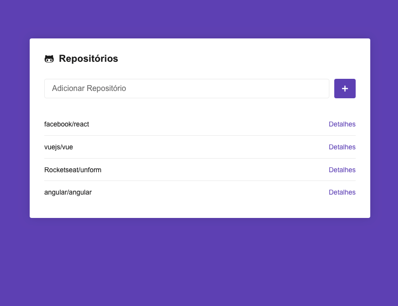
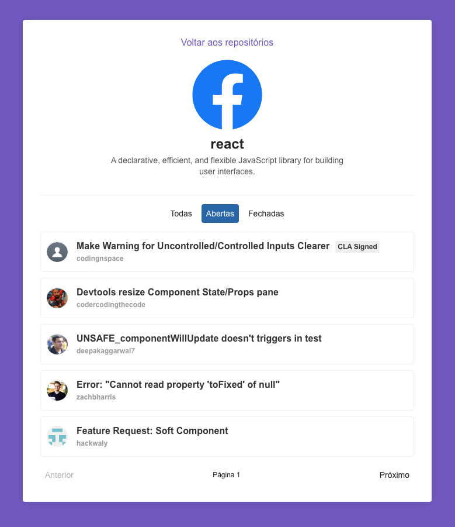

<h1 align="center">
    
</h1>

<h3 align="center">
  Repositórios do GitHub - Aplicação desenvolvida durante o curso de ReactJS
</h3>

<h3 align="center">
  #rocketseat, #reactjs, #axios, #prop-types, #react-icons, #react-router-dom, #styled-components
</h3>

  

  

  

  <a href="#rocket-sobre-a-aplicação">Sobre a Aplicação</a>&nbsp;&nbsp;&nbsp;|&nbsp;&nbsp;&nbsp;
  <a href="#telas-da-aplicação">Telas da Aplicação</a>&nbsp;&nbsp;&nbsp;|&nbsp;&nbsp;&nbsp;
  <a href="#memo-licença">Licença</a>

## :rocket: Sobre a Aplicação

A aplicação que iremos dar início ao desenvolvimento a partir de agora é um app gerenciador de repositórios do GitHub, onde o usuário pode adicionar repositórios para acompanhar, podendo detalhar a descrição do repositório e listar a suas issues.

Abaixo segue todo o conteúdo que foi abordado no curso para o desenvolvimento da aplicação.

## Primeiro projeto com ReactJS

- Criando projeto do zero
- ESLint, Prettier & EditorConfig
- Roteamento no React
- Styled Components
- Estilos globais
- Estilizando página Main
- Adicionando repositórios
- Listando repositórios
- Utilizando LocalStorage
- Navegação de rotas
- Carregando dados da API
- Definindo PropTypes
- Exibindo repositório
- Exibindo issues

## Telas da Aplicação

### Página Principal

### Página Repositório

## :memo: Licença

Esse projeto está sob a licença MIT. Veja o arquivo [LICENSE](LICENSE.md) para mais detalhes.

---

Feito com ♥ by Rocketseat :wave: [Entre na nossa comunidade!](https://discordapp.com/invite/gCRAFhc)
